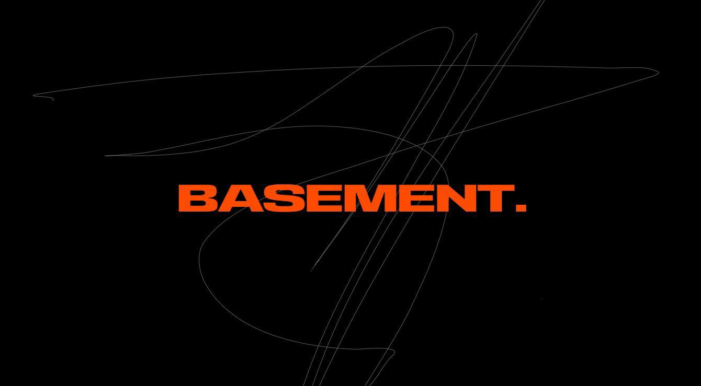

# @bsmnt-works/basewire
Welcome to `basewire`, the stack that designed to kick-starting our project. 

This tool provides an opinionated yet customizable starter for Laravel appliations, integrating the tool and libraries we trust and recommend.

Everything the developer will need (in terms of configuration) — prettier are configured to work independent of the user's IDE configuration (as long as it's vscode).

## Featured Aspects of the Stack
- Core
    - Laravel
    - Jetstream
    - Laravel Reverb
    - Laravel Blueprint

- UI
    - LiveWire
    - Tailwind

## Development
1. Server requirement:
    - Web server: `Nginx`/`Xampp`
    - Composer
    - Node.js & npm/yarn

2. Installing all dependencies that we need:
    - `composer install && yarn`
    - `cp .env.example .env`
    - `php artisan migrate --seed`
    - `php artisan key:generate`

3. Start developing and watch for code changes:
    - `php artisan serve && yarn dev`

----
    
If you find you need to make extra config to make this work more seamlessly, feel free to submit a PR suggesting your changes. Our focus is to get you up and running with the least steps and burden as possible.

-----

@bsmnt-works — _we make cool shit that perform's_

